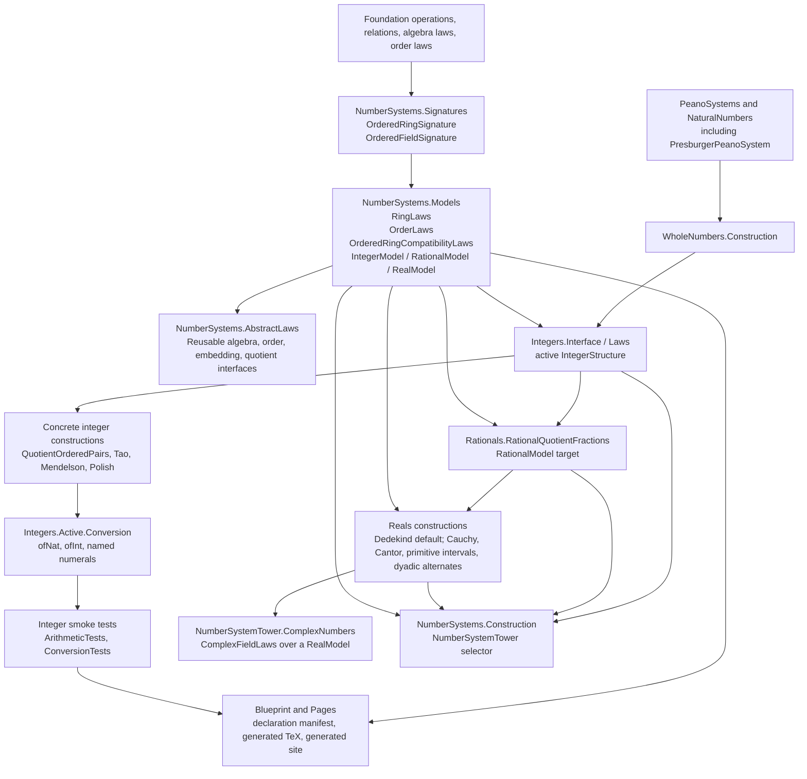

# Part 0e — Proof-Preparation Roadmap

## 0. Purpose

This document records the current Lean architecture for the number-system
formalization and the intended path from proof-ready statements to checked
proofs. It is operational documentation, not a new mathematical source chapter.
The goal is to keep the Markdown, Lean interfaces, tests, conversion utilities,
Blueprint, and Pages site synchronized while proofs remain intentionally pending.

## 1. Current Interface Shape

The Lean formalization uses three explicit layers for each configurable number
system:

- a signature containing carrier data, operations, constants, and relations;
- law bundles containing proposition-valued requirements;
- model bundles pairing a signature with the laws it satisfies.

The shared public model layer separates concerns:

- `RingLaws` contains additive, multiplicative, identity, inverse, and
  distributive algebraic requirements;
- `OrderLaws` contains only the strict and nonstrict order requirements;
- `OrderedRingCompatibilityLaws` contains the bridge requirements saying that
  addition and positive multiplication preserve the strict order;
- `OrderedRingLaws` is only a composed convenience bundle;
- `IntegralDomainLaws` is algebraic, while `OrderedIntegralDomainLaws` composes
  integral-domain algebra with order and ordered-ring compatibility.

The integer implementation layer mirrors this split with:

- `IntegerAdditiveLaws`;
- `IntegerMultiplicativeLaws`;
- `IntegerRingLaws`;
- `IntegerOrderLaws`;
- `IntegerOrderedRingCompatibilityLaws`;
- `IntegerOrderedRingLaws`;
- `IntegerLaws`.

The active integer implementation switch exposes client-facing constructors in
`LRA.VolumeII.Integers.Active.Conversion`. Examples and smoke tests should use
that conversion API unless they are deliberately testing a concrete
construction.

## 2. Construction and Test Policy

Proof-preparation work should add real interfaces and real statements, but
should not begin long construction proofs merely to connect the architecture.
Allowed proof-prep changes include:

- conversion utilities such as `ofNat`, `ofInt`, and named small numerals;
- smoke tests that are definitional or use already available law fields;
- declaration and Blueprint mapping updates;
- diagrams and roadmaps that explain the proof order;
- construction-specific theorem statements with `sorry` only in proof bodies.

Do not use fake definitions, fake predicates, or `True` placeholders to make
documentation look complete.

## 3. Architecture Diagram

## 4. Proof Path

The proof path should move from low-level reusable obligations to high-level
substitutability:

1. Finish common foundation lemmas for operations, relations, quotients,
   recursion, and algebra/order transport.
2. Check Peano and natural-number recursion, then Presburger as a Peano-style
   natural-number system with primitive addition.
3. Check whole-number construction from natural arithmetic.
4. Check the default integer construction against the split integer law bundles.
5. Check conversion utilities and active implementation smoke tests against
   each concrete integer carrier.
6. Check rational quotient fractions over the selected integer model.
7. Check the canonical integer-to-rational embedding and rational density.
8. Check Dedekind cuts as the default real model over the selected rational
   model.
9. Check comparison/isomorphism statements for Cauchy, Cantor, primitive
   intervals, and dyadic constructions.
10. Check computable reals, extended reals, interval arithmetic, irrational
    interfaces, complex numbers, characteristic/cardinality, and the comparison
    matrix.
11. Promote Blueprint declaration statuses from `statement-mapped-proof-sorry`
    to `proved` as each proof body is completed.

## 5. Documentation and Publishing Loop

Every architecture change should follow this loop:

1. update Lean interfaces and focused smoke tests;
2. update the Markdown roadmap or source chapter affected by the change;
3. regenerate the declaration manifest and Blueprint inputs;
4. run Lean proof-readiness checks;
5. build the generated site and Blueprint artifacts;
6. publish through the GitHub Pages workflow after the branch is pushed.

